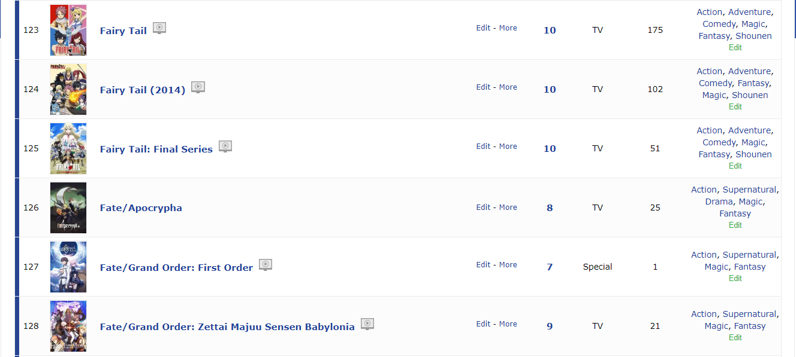
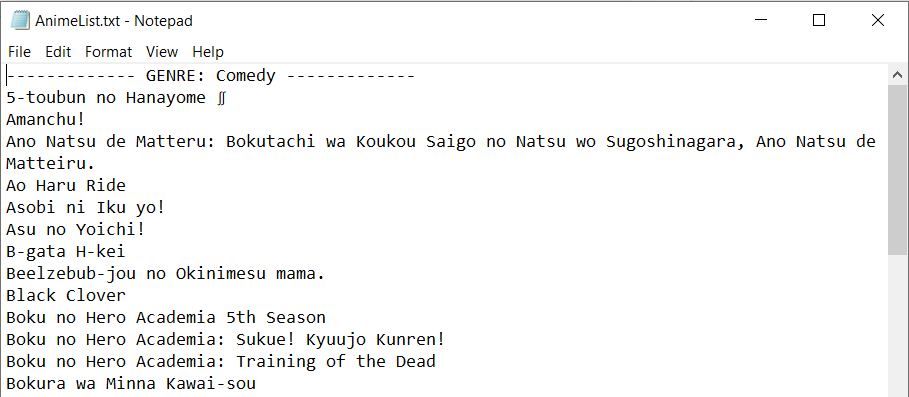

# MAL Genre Adder & Searcher
MAL (MyAnimeList) is the world's most active online anime and manga community and database. It is an anime and manga social networking and social cataloging application website. This program allows for users to search through their list and compile all their "Plan to watch" shows with a specific genre into a list, which will be displayed in Notepad.

## Usage
The program makes use of the "Tag" section (right hand side of list) of each anime in a user's list by automatically labeling the tags of each anime with their respective genres. By doing so, the program is then able to sort through all of the shows in the user's "Plan to watch" list and retrieve specific animes by genre.
 <br />**Note**: Because the program uses web-scraping, if the html on the MAL website changes the program may not work and will need to be updated with the new XPATHS. <br />


The program utilizes python, which will need to be installed in order to run.
The program can be run by navigating to the project directory in the command prompt and typing in the batch file command "get_anime". <br />
``` get_anime # Run in command prompt ``` <br />
Afterwards, a series of prompts will be given to navigate the user in adding genres to one's list or exporting/uploading a list from MAL to search for animes of a specific genre.


## Output


## Notes
- Chromedriver.exe file included to keep selenium updated with chrome (need to delete and download new chromedriver whenever chrome has update from [here](https://chromedriver.storage.googleapis.com/index.html)). To update chromedriver, download the chromedriver zip file, extract the chromedriver.exe file and save in MAL program folder (replace previous chromedriver.exe file if the old file is already there).

- To run the file in the command line from any directory (i.e. the default directory): <br />
    1. Copy the directory path of the chromedriver.exe file (not including the chromedriver.exe file itself)
    2. Open Environment Variables and click on the **Path** variable under User variables
    3. Paste the directory path in a new environment variable


